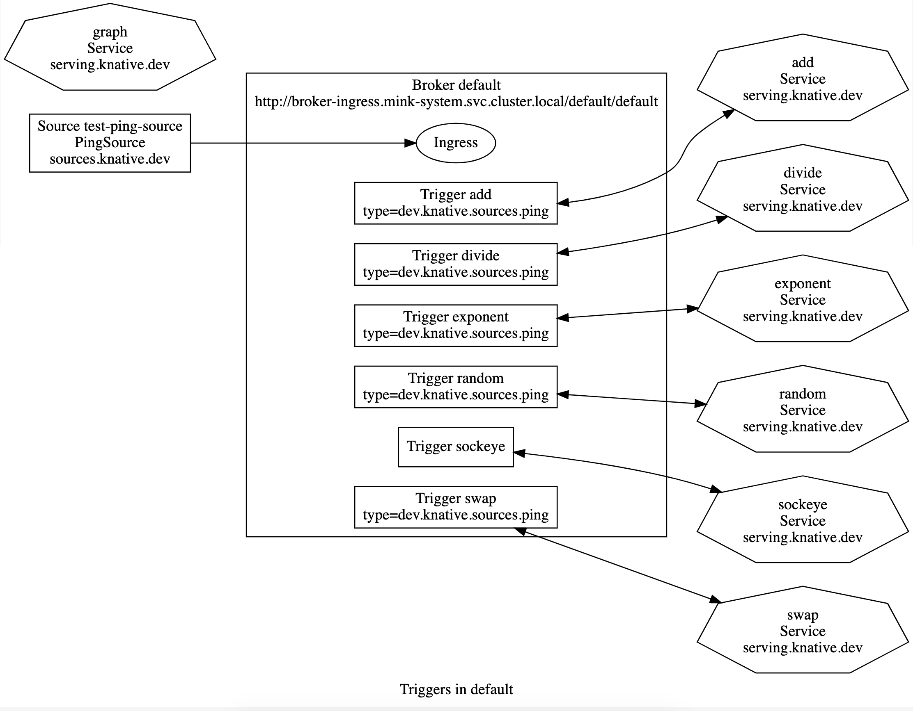

# Node.js Sample with `mink apply`

_This repository assumes that you have the latest release of [`mink`](https://github.com/mattmoor/mink) CLI installed locally and the controllers on your cluster._

## Deploying Everything

With a appropriately configured `~/.mink.yaml` deploying everything in this repository is as simple as:

```shell
mink apply

```

This will deploy:
1. A PingSource that will drop events onto the default Broker every minute.
2. A number of functions that trigger off of "ping" event types and mutate the events in trivial ways.
3. Scotty's [sockeye](https://github.com/n3wscott/sockeye) tool and an unfiltered trigger on the default broker.


## Visualizing the sample

You can also install Scotty's [graph](https://github.com/n3wscott/graph#deploying) tool
to visualize what we are deploying:



On the left, you can see the PingSource dropping things on the broker.

In the center, you can see the triggers and their filters (all ping event types).

Each of the triggers links to a Service on the right, which align with the directories in this repository.


## Inspecting the flow of events

You can use sockeye to inspect the events, its trigger is unfiltered, so it will see all of the events flowing through the Broker.  You can get sockeye's URL with:

```shell
# kubectl get ksvc sockeye
NAME      URL                                    LATESTCREATED   LATESTREADY     READY   REASON
sockeye   https://sockeye.default.ducktagon.io   sockeye-00001   sockeye-00001   True    
```

Open the URL, and after a minute you should see a number of events start appearing.  The first will probably be our "ping" event, which uses the fixed payload:

```yaml
{
  "a": 11,
  "b": 3,
}
```

Each of our sample functions apply some trivial transformation to this initial payload, and each transformed payload uses a new event type corresponding to the function name. For example, the `divide` function returns `a/b` as the new `a` and `a%b` as the new `b`:

```yaml
{
  "a": 3,   # <-- 11/3
  "b": 2    # <-- 11%3
}
```

## Iterating on a single function

You can iterate on a single function (e.g. `add`) via:

```shell
mink apply -f add
```

Try making a small change, e.g. change the `filter` in `./add/service.yaml` to consumer the output of `divide`:

```yaml
  filter:
    attributes:
      type: dev.mink.apply.samples.divide
```

Once deployed, you can see the filter change in [graph](https://github.com/n3wscott/graph#deploying), and should see the result of `add` now start to look like:

```yaml
{
  "a": 5, # <-- 3+2
  "b": 1  # <-- 3-2
}
```

## Releasing

You can build a `release.yaml` for this repository with:
```shell
mink resolve --image=gcr.io/my-releases/images > release.yaml
```

